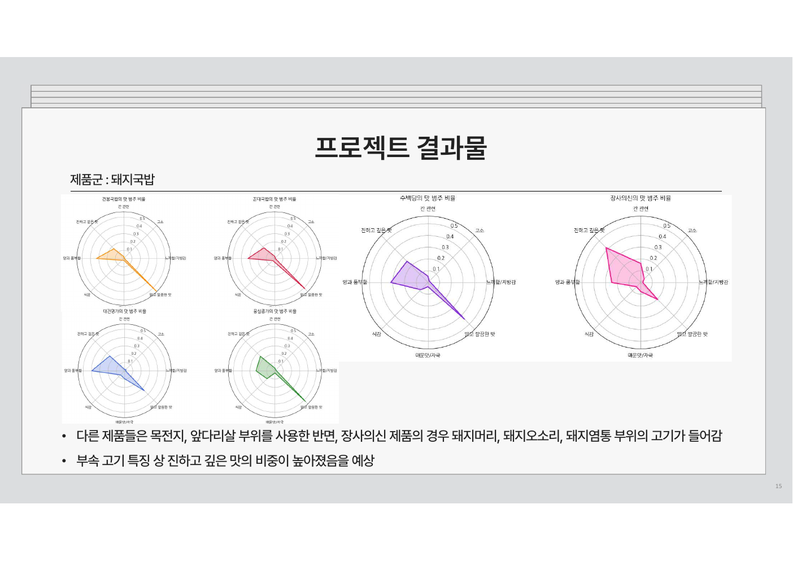

# 레스토랑 간편식(RMR) 리뷰 기반 한식 맛 평가 기준 수립

<p align="center">2025.05.14–07.11 · 미래내일 일경험 · 웨이브앤바이브 · 4인 팀 프로젝트 · 공개 포트폴리오</p>

<p align="center">
  
  
  
  
  
</p>

> 네이버 스마트스토어의 공개 **레스토랑 간편식(RMR, Restaurant Meal Replacement)** 리뷰를 수집·전처리하고, 소비자가 한식의 맛을 설명할 때 사용하는 표현을 제품군별로 구조화한 데이터 분석 프로젝트입니다.

## 프로젝트 한눈에 보기

| 항목 | 내용 |
| --- | --- |
| 공식 과제명 | 웹크롤링을 통한 RMR 리뷰 수집 및 분석을 통한 한식 맛 평가 기준 수립 |
| 진행 시점 | 2025년 미래내일 일경험 프로젝트 |
| 분석 대상 | 네이버 스마트스토어의 레스토랑 간편식(RMR) 리뷰 |
| 범위 | 돼지국밥·김치찌개·불고기·떡갈비·비빔밥 5개 제품군, 18개 제품 |
| 수집 규모 | 총 113,614개 공개 리뷰 |
| 핵심 산출 | 제품군별 맛 표현 체계, 빈도 기반 비교 분석, 크롤링·전처리·분석 노트북 |

## 발표자료·시각 증적

- [최종 발표자료 PDF](docs/presentation/rmr-final-presentation.pdf)
- [돼지국밥 제품군 맛 표현 비교 이미지](docs/assets/rmr-pork-gukbap-taste-profile.png)

아래 이미지는 최종 발표에서 사용한 **돼지국밥 제품군의 맛 표현 비율 비교**입니다. 제품별 공개 리뷰에서 추출·범주화한 표현의 상대 비중을 레이더 차트로 나타낸 것으로, 제품 품질의 객관적 점수나 인과관계를 의미하지 않습니다.

<p align="center">
  
</p>

## 문제 정의

레스토랑 간편식(RMR) 시장의 제품 리뷰에는 맛에 관한 소비자 표현이 축적되어 있지만, 제품군 사이의 차이를 비교할 수 있는 일관된 기준으로 정리하기는 어렵습니다. 이 프로젝트는 리뷰의 별점만 비교하는 대신, 소비자가 실제로 사용한 맛 표현을 수집하고 정제해 다음 질문에 답하는 데 초점을 두었습니다.

1. 소비자는 각 제품군의 맛을 어떤 단어로 설명하는가?
2. 같은 제품군 안에서 제품별 맛 표현 비중은 어떻게 다른가?
3. 식품 기획·개선·마케팅에서 참고할 수 있는 맛 표현 기준을 어떻게 만들 수 있는가?

## 분석 흐름

```text
네이버 스마트스토어 공개 리뷰 수집
  → 제품군·제품 단위 정리
  → 중복·특수문자·비대상 옵션 제거
  → 형태소 분석과 표제어 정규화
  → 맛 관련 표현 선별·범주화
  → 제품군별 빈도와 비율 비교
```

### 1. 리뷰 수집

Selenium과 BeautifulSoup4를 사용해 제품별 리뷰를 수집했습니다. 사이트 유형과 리뷰 페이지 구조가 달라 제품·스토어별 접근 방식이 필요했고, 직접 제품 링크 접근 시 발생한 봇 차단은 스토어 페이지를 거쳐 제품을 선택하는 흐름으로 대응했습니다.

### 2. 텍스트 전처리

리뷰의 중복·특수문자·숫자를 정리하고, 제품군과 맞지 않는 세부 옵션을 분리했습니다. 이후 KoNLPy `Okt`로 명사·동사·형용사를 중심으로 토큰화하고, 활용형은 표제어로 정규화했습니다. 한 리뷰에서 같은 표현이 반복될 경우에는 한 번으로 계산해 반복 문구가 빈도를 과도하게 키우지 않도록 했습니다.

### 3. 맛 표현 분석

맛 관련 표현을 `싱겁다·짜다`, `고소`, `느끼함/지방감`, `매운맛/자극`, `맑고 깔끔한 맛`, `식감`, `양과 풍부함`, `진하고 깊은 맛` 등으로 정리했습니다. 표현 빈도는 제품별 맛 표현이 포함된 리뷰 수를 기준으로 비율화해, 단순 리뷰 수 차이보다 제품별 표현의 상대적 비중을 비교하도록 했습니다.

부정어가 붙은 표현은 규칙 기반으로 `NOT_표현` 형태로 구분했습니다. 다만 이 프로젝트의 1차 목적은 긍·부정 감성 분류가 아니라 소비자가 **어떤 맛 표현을 얼마나 사용했는지**를 파악하는 것이므로, 최종 비교에서는 표현의 사용 양상을 우선했습니다.

## 공개 저장소 범위

| 포함 | 제외 |
| --- | --- |
| 크롤링·전처리·제품군별 분석 흐름을 담은 공개용 노트북 | 원본 리뷰, 작성자 식별 가능 필드, 전처리 데이터 |
| 최종 발표자료 PDF와 공개 가능한 제품군별 결과 이미지 | 계약·계좌·결제·정산·제출 문서 |
| 프로젝트 맥락과 분석 기준, Python 의존성 및 실행 안내 | 원본 편집 파일, 내부 산출물, 로컬 ChromeDriver |

`notebooks/`는 원본 노트북에서 실행 결과와 셀 실행 번호를 제거한 공개용 사본입니다. 원본 데이터와 중간 산출물이 포함되지 않으므로, 이 저장소는 동일한 집계 결과를 완전히 재현하는 배포본이 아니라 실제 분석 과정과 방법을 검토하는 포트폴리오 공개본입니다.

## 저장소 안내

```text
.
├── data/                       # 비공개 데이터의 공개 기준 안내
├── docs/
│   ├── assets/                  # 공개 가능한 결과 이미지
│   └── presentation/            # 최종 발표자료 PDF
├── notebooks/                  # 순서와 역할을 정리한 공개용 분석 노트북
│   └── archive/                # 중복 전처리 초안 보관
├── private/                    # Drive 원본 보관 영역 (GitHub에서는 README만 추적)
├── .gitignore                  # 데이터·원본 문서·로컬 도구 제외 규칙
├── README.md
└── requirements.txt
```

노트북별 목적과 권장 실행 순서는 [notebooks/README.md](notebooks/README.md), 데이터 비공개 기준은 [data/README.md](data/README.md)에서 확인할 수 있습니다.

## 실행 안내

Python 3.9 이상 환경에서 아래 의존성을 설치합니다.

```bash
pip install -r requirements.txt
```

데이터는 공개하지 않습니다. 적법하게 확보하고 비식별화한 데이터를 프로젝트 루트의 `data/`에 배치한 뒤, 루트에서 Jupyter를 실행하세요. 일부 원본 노트북에는 당시 Colab 경로가 남아 있으므로, 실행 환경에 맞춰 입출력 경로를 조정해야 합니다.

## 한계와 이용 안내

리뷰 표현의 빈도는 제품 품질의 객관적 점수나 인과관계를 뜻하지 않습니다. 제품 구성·구매자 특성·리뷰 작성 맥락의 차이를 함께 고려해야 하며, 문맥 기반 감성 해석은 후속 과제입니다.

이 저장소는 포트폴리오·학습 기록 열람을 위해 공개합니다. 코드·문서의 재사용, 수정, 배포는 사전 문의가 필요합니다.
